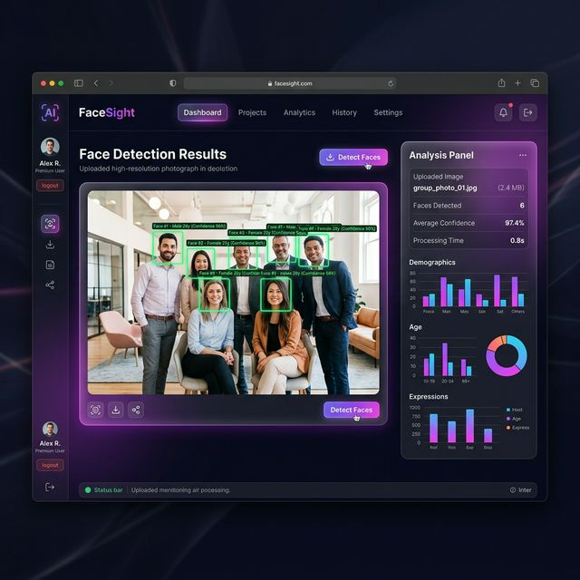

# FaceSight - AI Face Detection App 👤



FaceSight is a modern, premium web application that allows you to upload any image and instantly detect and count the faces within it using AI. Built with a decoupled architecture featuring a stunning React (Vite) frontend and a lightning-fast FastAPI backend powered by OpenCV.

## ✨ Features

- **Beautiful UI/UX:** Premium glassmorphism design with immersive hover effects and micro-animations.
- **Drag & Drop:** Easily upload images via drag-and-drop or file browser.
- **FastAI Backend:** Powered by FastAPI for asynchronous, high-performance image processing.
- **Accurate Detection:** Utilizes OpenCV's Haar Cascade Classifiers to detect faces instantly.
- **Real-time Results:** Displays the processed image with glowing bounding boxes and the total face count.

## 🏗 Architecture

- **Frontend:** React + Vite + Vanilla CSS
- **Backend:** Python + FastAPI + OpenCV

## 🚀 Getting Started

To run this application locally, you will need to start both the backend API and the frontend development server.

### 1. Start the Backend API

Open a terminal and navigate to the backend directory:

```bash
cd "backend"
pip install -r requirements.txt
uvicorn main:app --reload
```
The FastAPI server will start on `http://localhost:8000`.

### 2. Start the Frontend Application

Open a second terminal and navigate to the frontend directory:

```bash
cd "frontend"
npm install
npm run dev
```
The React development server will start on `http://localhost:5173`. Open this URL in your browser to use the app!

## 🌍 Deployment

You can deploy the frontend on platforms like **Vercel** or **Netlify** (which natively support Vite projects).
The backend API can be containerized using Docker or deployed natively to services like **Render** or **Railway**.
